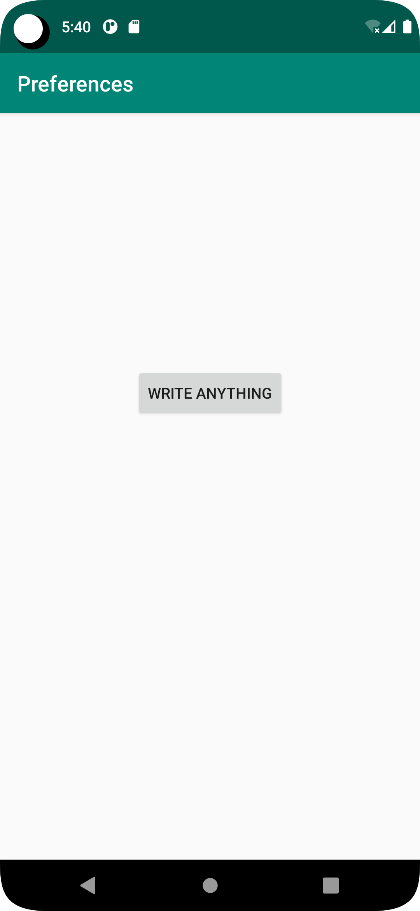
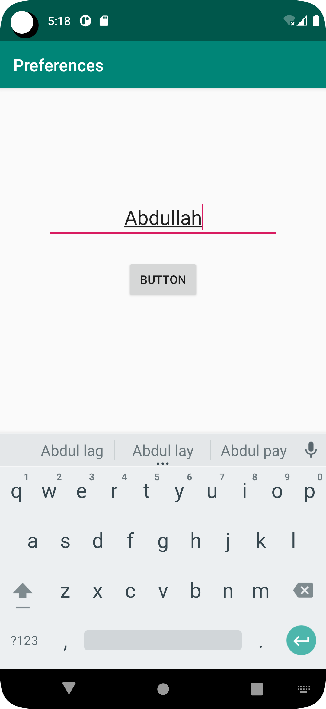
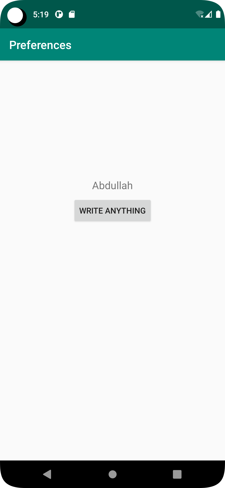

# Rapport

**First, the app has been developed with two activities.The first activity is used to read data from SharedPreferences that has been saved earlier for later use.
Additionally, the app has a new activity called SecondActivity to organize the user interface and enable navigation between different screens.
SecondActivity uses an EditText element that allows the user to enter data.
The data is then saved in the app's SharedPreferences, which can be accessed later.When SecondActivity closes, the saved data can be seen in MainActivity. 
This means that the data saved in SecondActivity can be accessed from other parts of the app.**


```
public class MainActivity extends AppCompatActivity {
    private Button button;
    private TextView sharedoutcome;
    private final String key = String.valueOf(R.string.ShowData);
    private SharedPreferences myPreferenceRef;
    private SharedPreferences.Editor myPreferenceEditor;

    @Override
    protected void onCreate(Bundle savedInstanceState) {
        super.onCreate(savedInstanceState);
        setContentView(R.layout.activity_main);
        Toolbar toolbar = findViewById(R.id.toolbar);
        setSupportActionBar(toolbar);

        button = findViewById(R.id.NameViewButton);
        sharedoutcome = findViewById(R.id.ShowViewName);

        myPreferenceRef = getPreferences(MODE_PRIVATE);
        myPreferenceEditor = myPreferenceRef.edit();

        button.setOnClickListener(new View.OnClickListener() {
            @Override
            public void onClick(View view) {

                startSecondActivity();
            }
        });
    }
    @Override
    protected void onResume() {
        super.onResume();
        Log.d("c22abdha", " startActivity");
        String defaultValue = "Nothing has been shared.";
        SharedPreferences sharedPref = getSharedPreferences(key, MODE_PRIVATE);
        sharedoutcome.setText(sharedPref.getString(key, defaultValue));
    }
    public void startSecondActivity(){
        Intent intent = new Intent(MainActivity.this, SecondActivity.class);
        startActivity(intent);
    }
}

```

```
 <TextView
        android:id="@+id/ShowViewName"
        android:layout_width="wrap_content"
        android:layout_height="wrap_content"
        android:text="@string/app_name"
        android:textSize="18sp"
        android:padding="8dp"
        app:layout_constraintBottom_toBottomOf="parent"
        app:layout_constraintEnd_toEndOf="parent"
        app:layout_constraintStart_toStartOf="parent"
        app:layout_constraintTop_toBottomOf="@+id/appBarLayout"
        app:layout_constraintVertical_bias="0.30" />


    <Button
        android:id="@+id/NameViewButton"
        android:layout_width="wrap_content"
        android:layout_height="wrap_content"
        android:text="write Anything"
        app:layout_constraintTop_toBottomOf="@id/ShowViewName"
        app:layout_constraintStart_toStartOf="@id/ShowViewName"
        app:layout_constraintEnd_toEndOf="@id/ShowViewName"/>
```

```
public class SecondActivity extends AppCompatActivity {
    private SharedPreferences sharedPreferences;
    private final String key = String.valueOf(R.string.ShowData);
    private Button button;


    @Override
    protected void onCreate(Bundle savedInstanceState) {
        super.onCreate(savedInstanceState);
        setContentView(R.layout.activity_second);
        sharedPreferences = getSharedPreferences(key, MODE_PRIVATE);

        button = findViewById(R.id.ViewButton);
        button.setOnClickListener(new View.OnClickListener() {
            @Override
            public void onClick(View view) {

                saveUserData();
                finish();
            }
        });
    }
    void saveUserData() {
        EditText input = findViewById(R.id.Writeinput);
        String data = input.getText().toString();
        SharedPreferences.Editor sharedPrefDataEditor = sharedPreferences.edit();
        sharedPrefDataEditor.putString(key, data);
        sharedPrefDataEditor.apply();
    }
}
```

```
 <EditText
        android:id="@+id/Writeinput"
        android:layout_width="wrap_content"
        android:layout_height="wrap_content"
        android:hint="@string/input"
        android:maxEms="20"
        android:minEms="10"
        android:textSize="24sp"
        android:gravity="center_horizontal"
        app:layout_constraintBottom_toBottomOf="parent"
        app:layout_constraintEnd_toEndOf="parent"
        app:layout_constraintStart_toStartOf="parent"
        app:layout_constraintTop_toTopOf="parent"
        app:layout_constraintVertical_bias="0.19999999" />


    <Button
        android:id="@+id/ViewButton"
        android:layout_width="wrap_content"
        android:layout_height="wrap_content"
        android:layout_marginTop="24dp"
        android:text="Button"
        app:layout_constraintEnd_toEndOf="@+id/Writeinput"
        app:layout_constraintStart_toStartOf="@+id/Writeinput"
        app:layout_constraintTop_toBottomOf="@+id/Writeinput" />
```

Bilder läggs i samma mapp som markdown-filen.





